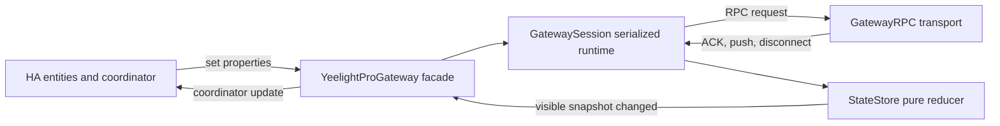
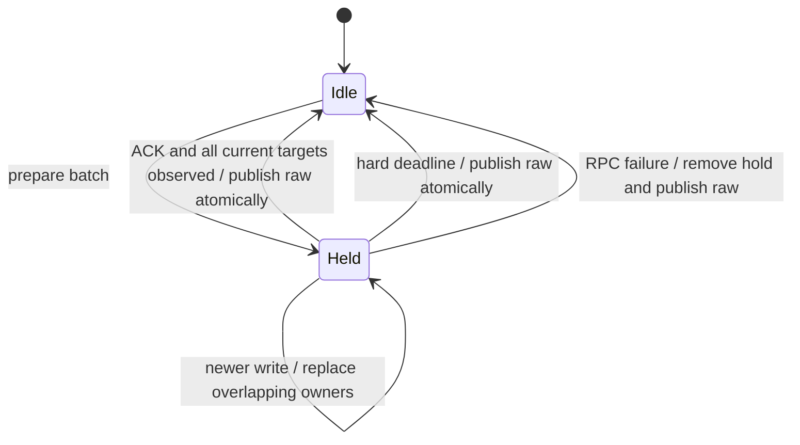

# Minimal state engine design

## Decision

The default HA-visible model is **non-optimistic observed-state latching**.

- Sending a command does not change HA state.
- Gateway ACK does not change HA state.
- A gateway push, readback, or full snapshot is an observation and always updates internal raw
  state.
- While a write is pending, affected visible fields remain at their last published values.
- When all still-current targets in the gateway batch have been observed, the whole batch is
  released to HA in one publication step.
- If confirmation does not arrive by a fixed deadline, pending protection ends and current raw
  state is published.

This is not raw-through and it is not optimistic projection. HA sees a previously observed state
while work is unresolved, then a newly observed state. The cost is delayed UI feedback. The benefit
is that unconfirmed command targets do not enter HA groups, automations, or history.

## Only three state concepts

### 1. Raw state

The latest gateway topology and property values, regardless of source. Push, node readback, group
readback, and full sync all merge here.

### 2. Visible state

The immutable node snapshot exposed to the coordinator and HA entities. No entity or listener can
read raw state directly.

### 3. Pending batch

A small record for one gateway write batch:

```python
@dataclass
class PendingBatch:
    id: int
    accepted: bool
    targets: dict[PropertyKey, object]
    observed: set[PropertyKey]
    deadline: float
```

`PropertyKey` can remain an ordinary `(node_id, property_name)` tuple. A separate owner map stores
which batch currently protects each key:

```python
raw: dict[NodeId, TopologyNode]
visible: dict[NodeId, TopologyNode]
batches: dict[int, PendingBatch]
owner: dict[PropertyKey, int]
```

No intent phases, confidence scores, progress heuristics, mismatch counters, quiet periods, or
transition-derived validity gates are required.

## Final component boundaries



### `GatewayRPC`

- TCP framing, request IDs, response futures, timeouts, and decoded unsolicited messages.
- No topology, command batching, HA state, or reconciliation policy.

### `GatewaySession`

- The only serialized runtime owner.
- Owns connection lifecycle, the short command batching window, timers, and `StateStore`.
- Converts decoded gateway messages into raw-state updates.
- Chooses the correct node or native-group readback method.
- Emits visible snapshot changes and diagnostics.

### `StateStore`

- A synchronous, deterministic object with no I/O and no `asyncio` tasks.
- Owns raw, visible, pending batches, and property ownership.
- Returns effects such as `visible_changed`, `batch_completed`, or `readback_needed`.
- Is tested by event sequences without Home Assistant or TCP mocks.

### `YeelightProGateway`

- A thin public facade used by the coordinator and entities.
- Exposes command methods, visible nodes, session status, and diagnostics.
- Does not duplicate state or command policy.

### HA coordinator and entities

- Subscribe only to visible snapshot changes.
- Remain push-managed (`should_poll=False`).
- Read availability from connection status and observed node online status.
- Normalize HA service arguments into protocol writes and await gateway ACK or failure.

## Pure state rules

### Prepare a batch

1. Allocate a monotonically increasing integer batch ID.
2. Register every target before the RPC is sent, even if raw already equals the target.
3. Assign each target key to the new batch in `owner`.
4. Remove overlapping keys from older batches. Older work can no longer release those keys.
5. Keep visible unchanged.

Registering a no-op-looking write is important: an old opposite mesh result can still arrive after
the new command. Current equality is not command confirmation.

### Accept or fail a batch

- ACK sets `accepted=True`; it does not mark targets observed and does not publish target values.
- RPC failure removes keys still owned by that batch, recomputes visible from raw, and completes
  every original HA future with the same error.
- A target observation may arrive before ACK and is remembered, but release waits for ACK.

### Apply gateway state

For each changed property:

1. Merge the value into raw.
2. If the property has no pending owner, copy it to visible.
3. If it is owned and equals that batch's target, mark it observed.
4. If it is owned and conflicts, retain the existing visible value.
5. When every target still owned by an accepted batch is observed, remove those owners and publish
   current raw for the whole batch in one state-store result.

Unrelated properties can publish immediately. A complete entity write remains safe because entity
properties read the visible snapshot, where protected fields are still held.

### Reconcile and expire

- Schedule one delayed cache readback for unresolved nodes. Do not poll repeatedly.
- Merge its result through the same `apply_gateway_state` rule.
- Use the native-group read method for native groups and the node method for ordinary nodes.
- At the hard deadline, remove remaining owners and publish current raw once.
- A mismatch at the deadline is an observed state, not an availability failure.

The initial implementation should use one measured readback delay and one hard deadline, defined in
one module and visible in diagnostics. Transition duration does not delay or validate observations.

### Superseding writes

For `A -> B -> A`, each new batch simply replaces property ownership:

- old callbacks carry an old batch ID and cannot clear the current owner;
- raw always records what the gateway said;
- visible retains the value that existed when the newest write began;
- only an observation matching the newest target, or its deadline, releases the field.

No separate generation type is needed; the batch ID is the stale-work fence.

## State transition



`Held` is not a public entity state. It is only the presence of entries in `owner`.

## Command batching

- Keep the existing short collection window because HA group fan-out can arrive concurrently.
- Serialize gateway write batches.
- Merge only non-conflicting requests. A conflicting property or incompatible transition flushes
  the current batch; do not collapse rapid user commands into last-write-wins at the RPC boundary.
- Create pending protection immediately before the serialized RPC send.
- Resolve each submitter's future on aggregate ACK or RPC failure, not on state convergence.
- Because ACK is aggregate, pending completion remains per observed target but visible release is
  one cohort operation for the gateway batch.

## Light command normalization

- `power=false` is always a standalone property set.
- Brightness, color temperature, and color imply `power=true` in the expected target set.
- A scene or multi-property update is one batch target, not a sequence of visible intermediate
  states.
- The configurable default transition remains a command option. If HA supplies an explicit
  transition, it wins. This value does not alter observation validity or add state-engine phases.

## Other domains

- Sensors and events have no command hold and publish observations immediately.
- Switch-like properties can use the same pending-batch rules as lights.
- Motor position and movement remain observation-driven. If HA needs opening/closing inference,
  keep it in a small cover-specific pure projector; do not put motor progress logic into the
  generic state store.
- Opaque actions such as blink have no state target and therefore create no pending batch entry.

## Availability and reconnect

- Gateway disconnect makes entities unavailable immediately and fails queued command futures.
- Pending batches are not persisted across reconnect.
- The first complete snapshot after reconnect becomes raw and visible without replaying old holds.
- A node's observed offline flag affects availability; command timeout does not.

## Minimal diagnostics

Diagnostics need only expose aggregate, sanitized values:

- connection state;
- queued request count and active batch count;
- active pending node/property counts;
- oldest pending age;
- number of target releases, deadline releases, and RPC failures;
- recent batch latency summaries without device names or raw payloads.

Debug logs may include runtime IDs for local diagnosis, but exported diagnostics must redact them.

## Explicit non-goals

- Inferring physical transition completion.
- Distinguishing a delayed old mesh result from a simultaneous external control immediately.
- Publishing optimistic target state or toggling `assumed_state` per command.
- Marking mismatched or pending nodes unavailable.
- Reproducing proprietary mesh internals in the integration.
