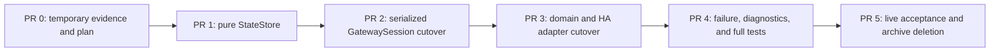

# Master migration plan

## Goal

Replace the current command-intent and reconciliation stack with the minimal design in
`DESIGN.md`, starting from current `master`, while keeping every merged step testable and ending
with no compatibility aliases or duplicate state owners.

The migration is complete only when:

- HA-visible state is observation-based and never contains an unobserved command target;
- raw gateway state has one owner and one publish boundary;
- multi-node writes do not expose member-by-member target convergence;
- old ACKs, readbacks, timers, and pushes cannot release a newer write;
- failures converge to observed state without false `unavailable`;
- the old intent/tracker/message vocabulary and this temporary workspace are deleted.

## Working rules

1. Build from `origin/master`; do not merge the experimental settled-state branch as a base.
2. Prefer a hard cutover over adapters between old and new state systems.
3. Do not add deprecated aliases for old diagnostics or methods.
4. Keep protocol transport, runtime serialization, state reduction, and HA adaptation separate.
5. Every timing rule must have one name, one definition, diagnostics, and a measured reason.
6. Do not merge a PR that creates two active state owners or lets entities read raw state.
7. Preserve the current default-light-transition option as command behavior only.

## PR sequence



The runtime PRs are intentionally ordered. Parallel work is safe only where file ownership is
disjoint; central session files should have one owner at a time.

### PR 0 - Temporary evidence and plan

Scope:

- Add this temporary workspace.
- Archive original reports, probes, and captures under ignored `private/`.
- Record hashes and provenance in the private manifest.
- Make no runtime change.

Exit gate:

- Public files pass a privacy scan.
- Private artifacts are ignored by Git.
- The plan identifies explicit deletion criteria.

### PR 1 - Pure `StateStore`

Scope:

- Add one synchronous state module containing `StateStore` and `PendingBatch`.
- Reuse the existing node/topology representation instead of creating parallel node DTOs.
- Implement prepare, ACK, failure, raw merge, target match, supersession, batch release, deadline,
  disconnect, and initial-sync rules.
- Add table-driven and randomized reducer tests. Do not wire it to HA yet.

Required sequence tests:

- off command, late on, then observed off;
- on command when raw already says on, followed by a late off;
- `A -> B -> A` with old target pushes and old timer callbacks;
- target observation before ACK;
- RPC failure after conflicting raw arrived;
- partial target confirmation across ordinary and group nodes;
- one missing target followed by readback match;
- deadline with an online mismatch;
- deadline with an observed offline node;
- disconnect and clean reconnect;
- unrelated property update while one property is held.

Invariants:

- visible target values must have appeared in a gateway observation;
- a callback with an old batch ID cannot change a newer owner;
- raw always contains the latest observation;
- no batch remains after its deadline;
- one completed batch produces at most one visible publication result.

### PR 2 - Serialized `GatewaySession` cutover

Scope:

- Make one runtime actor/task own command collection, state, timers, and readback scheduling.
- Keep the RPC transport limited to framing, request correlation, and connection events.
- Move conservative batching into the session runtime; remove the separate batcher actor.
- Prepare state protection before the RPC send, ACK/fail it afterward, and serialize batches.
- Route push, full sync, and readback through `StateStore`.
- Use one delayed readback and one hard deadline.
- Delete the old device-state actor, command-intent registry, weak/strong conflict rules, repeated
  refresh mismatch logic, and their message types in the same PR.

This is the largest PR, but the cutover is atomic: no feature flag and no dual-write bridge.

Exit gate:

- A mocked transport proves command/push/ACK ordering.
- Native groups use group readback exclusively.
- Aggregate ACK resolves request futures but cannot complete unobserved nodes.
- Repository search finds no runtime reference to the removed state engine.

### PR 3 - Domain and HA adapter cutover

Scope:

- Make coordinator data the visible snapshot only.
- Ensure every entity is push-managed and reads no raw gateway object.
- Normalize light targets, including implicit power-on and standalone power-off.
- Preserve the configurable default transition and explicit HA override, but remove transition
  timing from state reconciliation.
- Keep sensors/events immediate and isolate any cover movement projection from generic state.
- Remove old public methods such as intent-specific pending and diagnostics APIs. Replace them with
  direct names such as `pending_writes()` only if still needed.

HA tests must assert state-event sequences, not just final values.

Exit gate:

- A light group command does not publish an unobserved target.
- A conflicting old observation does not produce an HA rebound.
- All members of a completed gateway batch publish in one coordinator update.
- No timeout changes availability unless connection or observed online state changed.

### PR 4 - Failure behavior and observability

Scope:

- Cover malformed RPC, timeout, disconnect, reconnect, partial execution, missing push, and stale
  readback cases end to end.
- Keep structured debug decisions and sanitized aggregate diagnostics.
- Remove debug fields that encode obsolete intent phases or conflict scores.
- Document the permanent public state contract in a short architecture document.

The permanent document should explain only:

- ACK versus observation;
- raw versus HA-visible state;
- non-optimistic latching and bounded raw fallback;
- native-group readback;
- transition configuration semantics.

It must not include raw captures, private topology, or proprietary documentation.

### PR 5 - Live acceptance and cleanup

Deploy the exact candidate commit to HAOS and run:

1. Repeated single-light on/off and brightness changes.
2. At least 20 alternating multi-member power batches.
3. At least 20 multi-member brightness batches.
4. Rapid `A -> B -> A` commands.
5. A command overlapping an automated or second-client opposite command.
6. A mixed online/offline batch using a safe test node.
7. Gateway disconnect/reconnect during a pending batch.

Acceptance criteria:

- no `off -> on -> off` or `on -> off -> on` HA sequence caused solely by late gateway state;
- no automation loop caused by a transient member rebound;
- group members release in one coordinator publication when targets confirm;
- unresolved work converges to raw by the deadline;
- entities remain available during ordinary pending/mismatch periods;
- no pending entry, timer, or future leaks after disconnect or shutdown;
- no runtime errors in the soak log.

After acceptance:

- delete `.migration/state-engine-v2/` and its ignored private contents;
- delete `.tmp_deploy/` and copied HA logs used by this migration;
- remove migration-only ignore rules;
- verify release archives contain no migration artifacts;
- treat final code, tests, and permanent architecture documentation as the only source of truth.

## Expected final file shape

The exact names may change during implementation, but the final responsibilities should be visible
from the tree without reading compatibility wrappers:

```text
session/
  gateway.py       # public facade
  runtime.py       # serialized GatewaySession and private runtime messages
  state.py         # pure StateStore and PendingBatch
  connection.py    # connection lifecycle
  rpc.py           # TCP RPC transport
```

Remove the old `session/model/intent.py`, separate device-state actor, separate set-property batcher
actor, and broad `session/messages/` taxonomy when their responsibilities move. Do not preserve old
names as aliases.

## Validation gates for every code PR

```text
uv run ruff format --check dev_tools custom_components tests
uv run ruff check dev_tools custom_components tests
uv run pytest tests/unit
```

Run HA runtime tests on Linux/CI for PRs that touch entities, coordinator behavior, config flow, or
service handling. Add targeted tests before broad live testing; do not use HAOS as the primary test
runner.

## Final code-review checklist

- [ ] Exactly one owner stores raw and visible node state.
- [ ] Exactly one code path publishes visible changes to the coordinator.
- [ ] ACK never writes target state.
- [ ] Every visible value came from a gateway push, readback, or full snapshot.
- [ ] Batch ID is the only stale callback fence.
- [ ] New writes replace overlapping ownership before send.
- [ ] Native groups never use ordinary-node readback.
- [ ] Readback is not called refresh in the final API.
- [ ] Transition duration is not a state-validity gate.
- [ ] Pending mismatch is not availability.
- [ ] RPC failure reaches every original HA caller.
- [ ] No compatibility methods preserve intent/overlay terminology.
- [ ] Old state-machine code and tests are deleted, not orphaned.
- [ ] Public diagnostics contain no private topology or raw payloads.
- [ ] Temporary migration artifacts are deleted before release.
